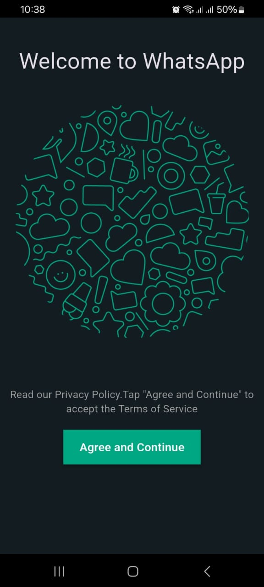
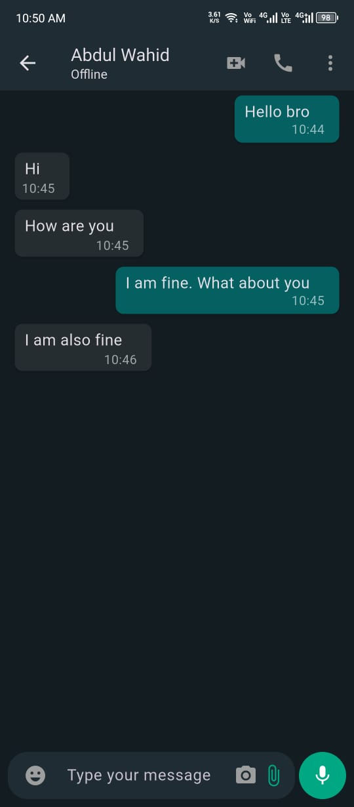
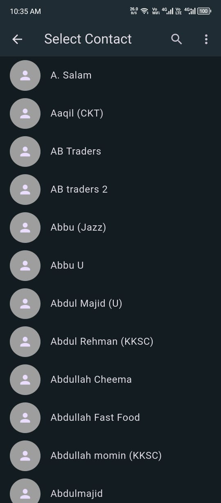
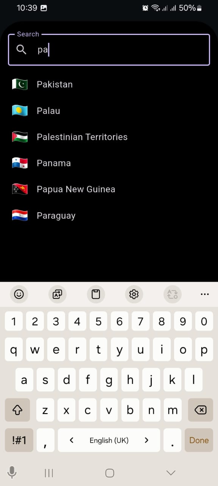
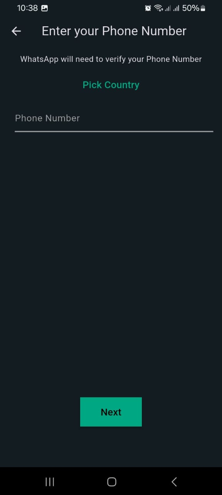
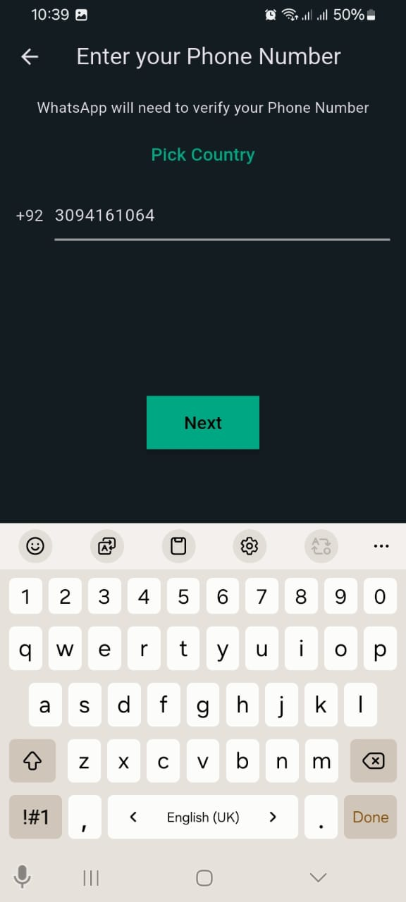
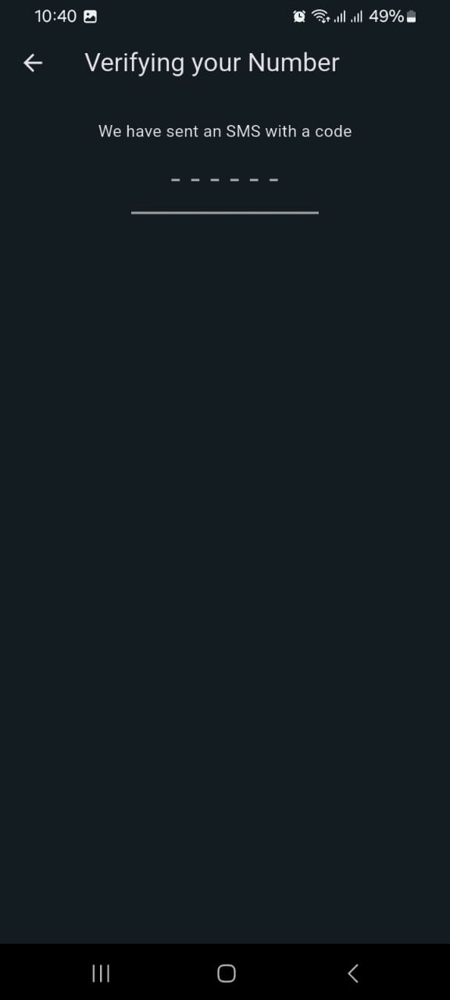
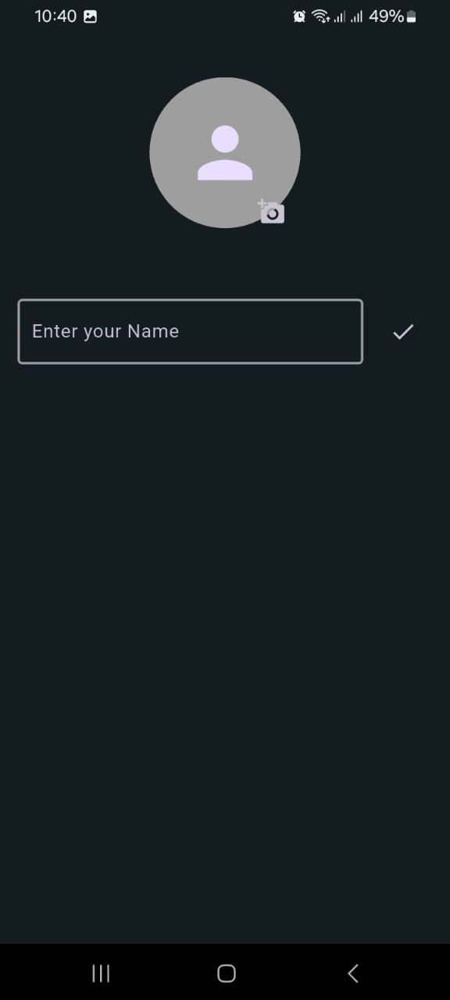
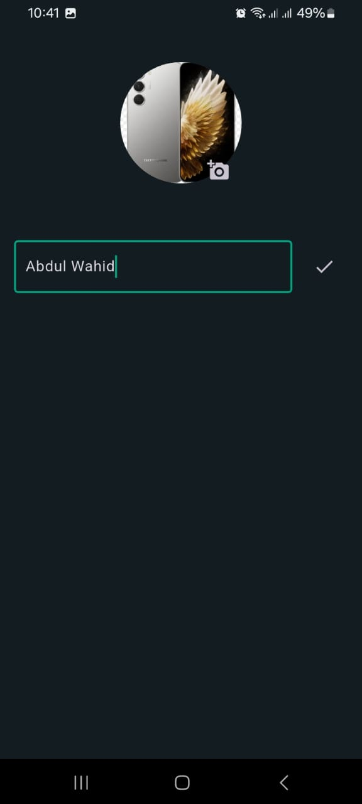

# 📱 WhatsApp Clone - Flutter

A fully functional **WhatsApp Clone** built with **Flutter**. This project demonstrates messaging functionality with Firebase Firestore and **phone number authentication**. The app focuses on **frontend development** while mimicking WhatsApp UI/UX features.

---

## 🚀 Features

- **User Authentication**
  - Sign up and login using **phone number**.

- **Real-time Chat**
  - One-to-one messaging between users.
  - Messages are stored in **Firestore** under the structure:  
    `users/{senderId}/chats/{receiverId}/messages/{messageId}`
  - Message data includes `text`, `senderName`, `timestamp`, and `senderId`.

- **UI/UX**
  - **Flutter ScreenUtil** used for responsive design.
  - Clean and dark theme mimicking WhatsApp design.
  
- **State Management**
  - **Provider / Riverpod 2** for managing authentication and chat state.
  - Loading, error, and data states handled gracefully.

- **Other Features**
  - Multi-screen navigation with **onGenerateRoute**.
  - Screens included: LandingView, HomeView, ChatView, Loader, ErrorView.
  - Responsive layouts for various devices.

---

## 🏗️ Project Structure

lib/
├─ data/
│ └─ firebase/ # Firebase config & options
├─ model/ # Data models (User, Message)
├─ view_model/
│ ├─ services/ # Service classes (e.g., FirebaseService)
│ └─ repository/ # Repository classes
├─ res/ # Resources (colors, fonts, images)
│ └─ components/ # Reusable UI components/widgets
├─ utils/ # Utility functions (Utils.dart)
└─ view/ # App screens (Landing, Home, Chat, Error, Loader)

## ⚡ Tech Stack

- **Frontend:** Flutter (Dart)
- **Backend:** Firebase
  - Authentication (Phone number)
  - Firestore Database
- **State Management:** Provider / Riverpod 2
- **Packages Used:**
  - `firebase_core`
  - `firebase_auth`
  - `cloud_firestore`
  - `flutter_screenutil`
  - `overlay_support`

---
## 📸 Screenshots

| | | |
|---|---|---|
|  |  |  |
|  |  |  |
|  |  |  |
|  |  |
---
## 📽️ Demo Videos

**🔹 Demo : Real Time Chat Demo Video**  
[Watch  Demo](https://drive.google.com/file/d/1HaMQNKpNcdzUQeqR0ULScyj2XZHQZfk6/view?usp=drivesdk)

## 🔧 Setup Instructions

### 1️⃣ Clone the repository
```bash
git clone https://github.com/daniyal-dev075/WhatsApp-Clone.git
cd WhatsApp-Clone
flutter pub get

